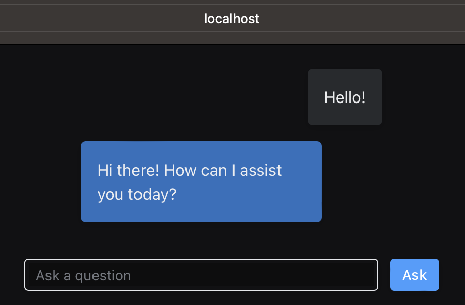

# Python Fullstack Example

This example demonstrates a fullstack application using llama-deploy to create and manage a RAG (Retrieval-Augmented Generation) and an Agentic workflow.



## Overview

The application consists of two main workflows:

1. RAG Workflow: A basic retrieval-augmented generation system.
2. Agentic Workflow: An advanced workflow that incorporates the RAG system and adds agentic capabilities.

These workflows are deployed as separate services using llama-deploy, allowing for flexible and scalable deployment options.

Then, a simple frontend is built using [reflex](https://reflex.dev/) to allow you to chat with the deployed RAG workflow and the agentic workflow.

## Project Structure

Let's walk through the important files and folders:

- `frontend/`: A simple frontend built using [reflex](https://reflex.dev/) to allow you to chat with the deployed RAG workflow and the agentic workflow.
  - `frontend/frontend/frontend.py`: The `reflex` app definition. Builds a basic chat UI.
  - `frontend/frontend/state.py`: The state management for the frontend. This is where we actually connect to the llama-deploy api to chat with the workflows.
  - `frontend/frontend/style.py`: The style management for the frontend. This is where we define the style of the chat UI.
- `workflows/`: The workflows themselves, including the RAG workflow and the agentic workflow.
  - `workflows/agent_workflow.py`: The agentic workflow that uses the RAG workflow.
  - `workflows/rag_workflow.py`: The RAG workflow. This includes indexing with a qdrant vector store, retrieval, reranking with RankGPT, and a response synthesis step.
  - `workflows/deploy.py`: The entrypoint for the dockerfile, which is used to deploy the workflows. The `DEPLOY_SETTINGS_NAME` environment variable is used to determine which workflow to deploy.

To orchestrate the core components of `llama_deploy` all you have to do is to include in your `docker-compose.py` one
of the pre-built compose files from this repository, like this:

```yaml
include:
  - path: ../../docker/docker-compose-redis.yml
```

### Dependencies

The project relies on several key libraries:

- llama-deploy: For service deployment and management.
- llama-index: For building and running the workflows.
- Various llama-index extensions for specific functionalities (e.g., `RankGPT`, `QdrantVectorStore`).

## Usage

1. Ensure you have [docker installed](https://docs.docker.com/engine/install/) and running.
2. Export your OpenAI key in your terminal (i.e. `export OPENAI_API_KEY="..."`)
3. Run `docker compose up` from the root of the project (in the `examples/python_fullstack` directory) to start the frontend and backend services.
4. Open your browser and navigate to `http://localhost:3000` to access the chat interface and chat with the deployed RAG workflow and agentic workflow.

## Service Details

- Control Plane:

  - Port: 8000

- RAG Workflow Service:

  - Port: 8002
  - Service Name: "rag_workflow"

- Agentic Workflow Service:

  - Port: 8003
  - Service Name: "agentic_workflow"

- Frontend:

  - Port: 3000

- Qdrant:
  - Port: 6333

The message queue service can be different, depending on the backend of choice. In this example, Redis is used, so
you would also see this service running:

- Redis

  - Port: 6379

## Extensibility

This example serves as a foundation for building more complex applications. You can extend the workflows, add new services, or integrate with other components of your system as needed.
